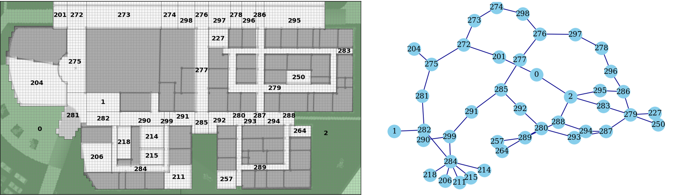

# VR Shooter Discrete Event Simulator



*Example environment layout (left) and corresponding graph representation (right).*

## Overview
This project implements a discrete-event simulation framework for modeling school shooter behavior, informed by virtual reality (VR) experimental data. The system integrates:

- Discrete-event simulation (DES) of shooter dynamics
- Graph-based modeling of environments
- Learned behavioral policies via Graph Neural Networks (GNNs)
- Reinforcement learning (RL) agents for decision-making

The goal is to study and simulate shooter movement, decision processes, and intervention strategies in structured environments.

---

## Features
- Discrete-event simulation engine for event-driven modeling
- GNN-based probability modeling of movement and behavior
- Reinforcement learning (DQN/DDQN) for policy learning
- Support for multiple environment layouts and scenarios
- Precomputed path and statistics caching for fast execution

---

## Project Structure
```
.
├── src/
│   ├── des/        # Discrete-event simulation logic
│   ├── gnn/        # Graph neural network models
│   ├── rl/         # Reinforcement learning agents and environments
│   └── utils/      # Shared utilities
│
├── data/           # Processed data
│   ├── environments/
│   ├── participants/
│   ├── shooters/
│   └── visual/
│
├── models/         # Trained models
│   ├── gnn/
│   └── rl/
│
├── README.md
├── requirements.txt
└── .gitignore
```

---

## Setup

### 1. Create environment
It is recommended to use a virtual environment or conda:

```bash
conda create -n tf210 python=3.10
conda activate tf210
```

### 2. Install dependencies
```bash
pip install -r requirements.txt
```

---

## Usage

### Run DES
```bash
python -m src.des.main
```

### Train GNN model
```bash
python -m src.gnn.train
```

### Train RL agent
```bash
python -m src.rl.train
```

### Test GNN model on real data
```bash
python -m src.gnn.test_real
```

### Test GNN model on VR data
```bash
python -m src.gnn.test_sim
```

### Compare heuristic and RL policies
```bash
python -m src.rl.test
```

---

## Data

This repository does **not include raw data, videos, or large artifacts**.

Included data:
- Participant data (cleaned)
- Precomputed cache for generated paths, node stats

Excluded data:
- Video recordings (for privacy)
- Large simulation outputs
- Model checkpoints

---

## Cache

Precomputed paths and statistics may be included to accelerate simulation runtime.

These files:
- are derived from underlying data
- are not strictly required
- can be regenerated if needed (by running the DES with desired settings)

---

## Models

The `models/` directory contains:
- GNN model checkpoints (TensorFlow format)
- RL model weights (.h5 format)

These are included to allow immediate use of pretrained models.

---

## Reproducibility

The simulation pipeline consists of:
1. Environment and graph construction
2. Transition modeling (GNN)
3. Event modeling (Sampling, means)
4. Optional policy learning (RL)

Due to stochastic components, results may vary slightly across runs.

---

## Notes

- TensorFlow warnings are suppressed in execution scripts
- Cache and model artifacts are separated from source code
- The repository is intended as a **research codebase and reference implementation**

---

## Citation

If you use this work, please cite:

```bibtex
@inproceedings{mcclurg2026develop,
  title={Developing a Discrete-Event Simulator of School Shooter Behavior from VR Data},
  author={McClurg, Christopher A and Wagner, Alan R},
  booktitle={2026 Annual Modeling and Simulation Conference (ANNSIM)},
  pages={1--13},
  year={2026},
  organization={IEEE}
}
```

---

## License

This project is licensed under the MIT License. See the LICENSE file for details.
